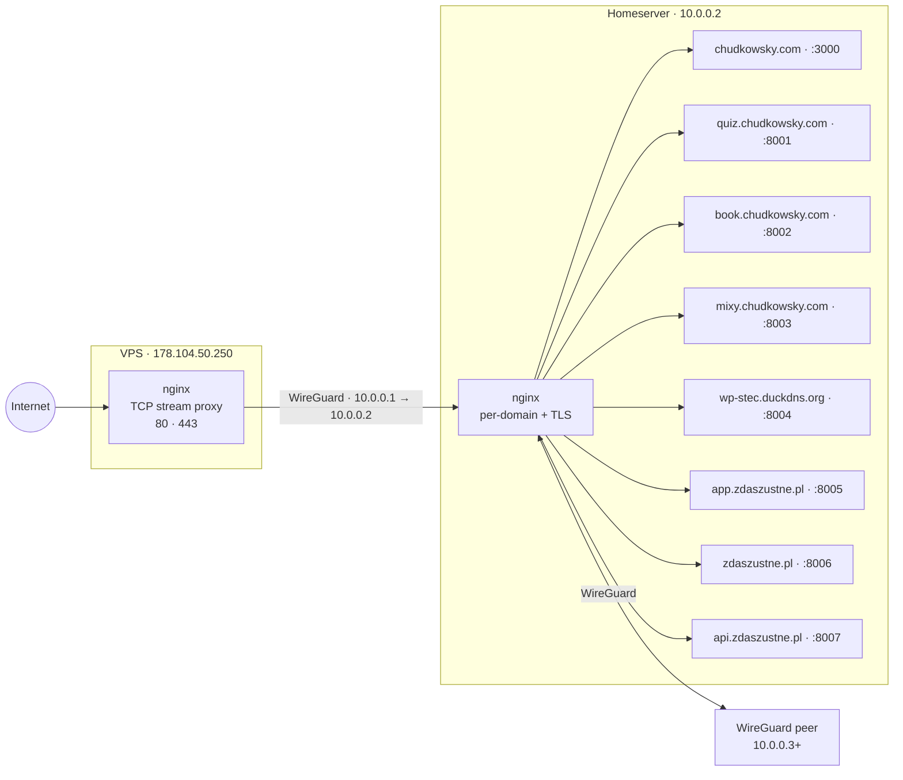

# homelab-infra

Documentation of the homelab infrastructure built with Piotr Stec. This repo serves as a knowledge base for understanding, maintaining, and extending the setup.

---

## Background

To enable new learning opportunities, I decided to build a homelab. My friend Piotr provided the hardware parts and together we assembled a v1 server.

The ISP (`play`) places residential connections behind CGNAT, meaning no public IPv4 or IPv6 address is available — only business clients get a public address. This made a VPS necessary to enable outside connectivity.

---

## Network Topology



**DNS & Domains:** `chudkowsky.com` and `zdaszustne.pl` are registered and managed on Cloudflare. `wp-stec.duckdns.org` uses DuckDNS. All DNS records point to the VPS public IP.

**WireGuard peers:**
- VPS ↔ Homeserver (primary tunnel for traffic forwarding)
- Homeserver ↔ WireGuard peer (additional peer)

---

## Hardware

### Homeserver

| Component     | Spec                                          |
|---------------|-----------------------------------------------|
| CPU           | Intel Core i3-8100 (4 cores, 4 threads, 6MB cache) |
| GPU           | Intel UHD Graphics 630 (integrated)          |
| RAM           | 8GB DDR4 Crucial Ballistix Sport 2400MHz     |
| Motherboard   | Gigabyte B360M DS3H                          |
| PSU           | Elementum E2 SI 350W 80Plus                  |
| Storage       | SSD GOODRAM CX400 GEN.2 256GB                |

### VPS (Hetzner)

| Component     | Spec                                          |
|---------------|-----------------------------------------------|
| CPU           | 2 vCPU (Intel Xeon Skylake, KVM/QEMU)        |
| RAM           | 4GB virtual                                  |
| GPU           | Virtio 1.0 (virtual)                         |

---

## Software

### Homeserver

| Property          | Value                        |
|-------------------|------------------------------|
| OS                | Ubuntu 24.04.4 LTS           |
| Kernel            | Linux 6.8.0-101-generic      |
| Architecture      | x86-64                       |
| Firmware Version  | F17 (2021-11-05)             |

### VPS

| Property          | Value                        |
|-------------------|------------------------------|
| OS                | Ubuntu 24.04.3 LTS           |
| Kernel            | Linux 6.8.0-90-generic       |
| Architecture      | x86-64                       |
| Vendor            | Hetzner vServer              |
| Firmware Version  | 20171111 (2017-11-11)        |

---

## Services

### Web Pages

All web services run via Docker Compose from `~/dev/chudas/` or `~/dev/piot/`.

| Domain | Port | Nginx name | Directory | Repository |
|--------|------|------------|-----------|------------|
| `chudkowsky.com` | 3000 | `page` | `~/dev/chudas/personal-page` | [chudkowsky/personal-page](https://github.com/chudkowsky/personal-page) |
| `quiz.chudkowsky.com` | 8001 | `quiz` | `~/dev/chudas/interview` | [chudkowsky/interview](https://github.com/chudkowsky/interview) |
| `book.chudkowsky.com` | 8002 | `docs` | `~/dev/chudas/howcryptoworksbook` | [chudkowsky/howcryptoworksbook](https://github.com/chudkowsky/howcryptoworksbook) |
| `mixy.chudkowsky.com` | 8003 | `mixy` | `~/dev/chudas/mix-parser` | [chudkowsky/mix-parser](https://github.com/chudkowsky/mix-parser) |
| `wp-stec.duckdns.org` | 8004 | `wp-stec` | — | — WordPress (Piotr) |
| `app.zdaszustne.pl` | 8005 | `ustne-app` | — | — |
| `zdaszustne.pl` | 8006 | `ustne-landing` | — | — |
| `api.zdaszustne.pl` | 8007 | `ustne-api` | — | — |

---

## Detailed Docs

- [Nginx](./nginx.md) — config templates, TLS, VPS stream proxy setup
- [WireGuard](./wireguard.md) — tunnel topology, peer config, useful commands
- [Adding a new service](./new-service.md) — manual flow for Cloudflare and DuckDNS
- [plans/](./plans/) — future migrations and automation
- [completed/](./completed/) — completed migrations with full step-by-step records

### Game Server

| Property | Value |
|----------|-------|
| Game | Minecraft |
| Version | Paper 1.21.10 |
| Port | 25565 (default) |
| Access | Public, whitelist-guarded |
| Directory | `~/dev/chudas/minecraft_server_2` |
| Process | Running directly on host in a `tmux` session (`mc-world-2`) |

```bash
# Start
tmux new-session -s mc-world-2 java -Xmx4G -Xms2G -jar minecraft_server.jar nogui

# Stop
tmux kill-session -t mc-world-2

# List sessions
tmux ls
```
